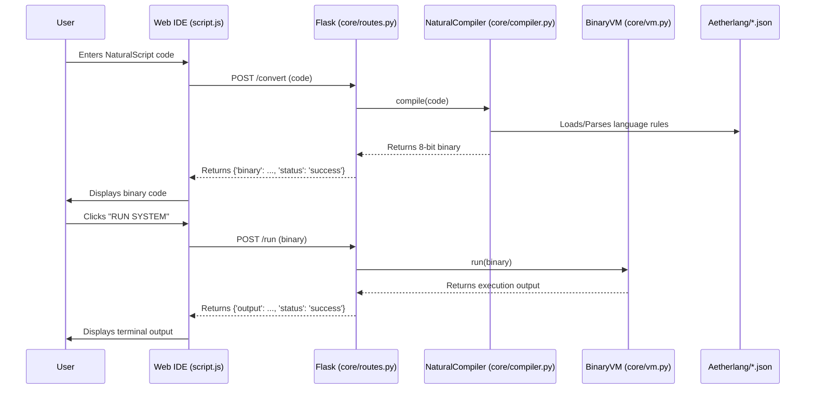
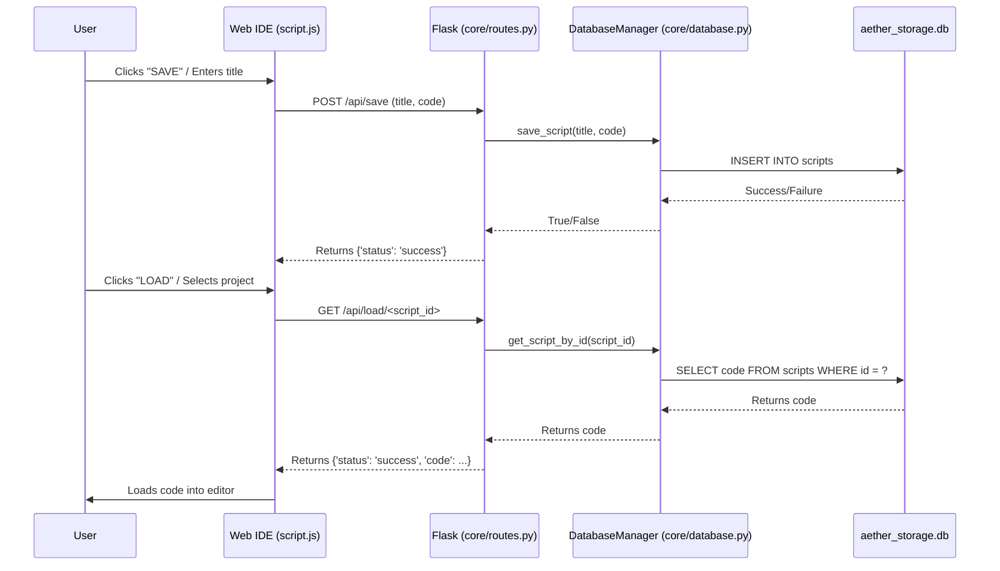
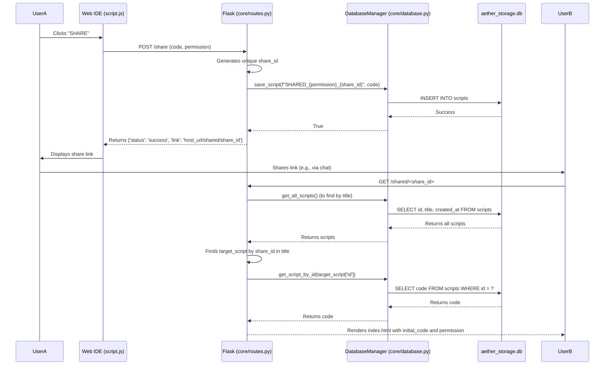

# AetherByte System Architecture

As the Principal System Architect for AetherByte, this document provides a comprehensive overview of the system's design, component responsibilities, interactions, and key architectural decisions. It is intended for developers, maintainers, and stakeholders to understand the underlying structure and operational flow of the platform.

## 1. System Overview

AetherByte is a web-based Integrated Development Environment (IDE) for NaturalScript, a human-readable programming language. It comprises a Flask backend serving a dynamic frontend, a custom compiler, an 8-bit Virtual Machine (VM), and an SQLite database for persistence.

### 1.1. High-Level Component Diagram

```mermaid
graph TD
    subgraph Frontend (Web IDE)
        A[User Interface (HTML/CSS/JS)]
        B[CodeMirror Editor]
        C[Binary Output]
        D[Terminal Output]
        E[Settings Panel]
    end

    subgraph Backend (Flask Application)
        F[app.py (Entry Point)]
        G[core/routes.py (API Endpoints)]
        H[config.py (Configuration)]
    end

    subgraph Core Logic
        I[core/compiler.py (NaturalScript Compiler)]
        J[Aetherlang/*.json (Language Definitions)]
        K[core/vm.py (8-bit Virtual Machine)]
        L[core/database.py (SQLite Manager)]
    end

    subgraph Data Storage
        M[aether_storage.db (SQLite Database)]
    end

    A -- User Input --> B
    B -- NaturalScript Code --> G
    G -- Compile Request --> I
    I -- Loads Rules --> J
    I -- Generates Binary --> G
    G -- Binary Code --> C
    C -- Binary Code --> G
    G -- Run Request --> K
    K -- Executes Binary --> G
    G -- VM Output --> D
    G -- Save/Load/Delete Requests --> L
    L -- Reads/Writes --> M
    G -- Share Request --> L
    G -- Shared Project Load --> L
    E -- User Settings --> A
```

### 1.2. Module Responsibilities and Interactions

*   **`app.py`**: The main entry point for the Flask application. It initializes the Flask app, loads configuration from `config.py`, registers the `core_bp` blueprint, and initializes the `DatabaseManager` to ensure the database schema is set up.
*   **`config.py`**: Centralized configuration management. It defines application-wide settings such as `SECRET_KEY`, `DEBUG` mode, the SQLite database file name (`DB_NAME`), and the directory for language definitions (`LANG_DIR`).
*   **`core/routes.py`**: Defines all API endpoints and web routes for the AetherByte application.
    *   Handles requests for compiling NaturalScript (`/convert`).
    *   Manages requests for running compiled binary code (`/run`).
    *   Provides CRUD operations for user scripts (`/api/save`, `/api/list`, `/api/load/<id>`, `/api/delete/<id>`).
    *   Implements project sharing functionality (`/share`, `/shared/<id>`).
    *   Renders the main IDE (`/`) and settings page (`/settings`).
    *   Acts as the orchestrator, connecting frontend requests to the `NaturalCompiler`, `BinaryVM`, and `DatabaseManager`.
*   **`core/compiler.py`**: The core component responsible for translating NaturalScript into 8-bit binary instructions.
    *   Dynamically loads language syntax rules from JSON files located in the `Aetherlang` directory (specified by `Config.LANG_DIR`).
    *   Uses regular expressions to match NaturalScript commands against loaded rules.
    *   Converts matched commands and their arguments into a sequence of 8-bit opcodes and binary representations of data (strings, integers).
*   **`Aetherlang/*.json`**: These JSON files define the grammar and corresponding opcodes for NaturalScript. Each file can contain a list of rules, each specifying a regex pattern, an opcode, and how to extract and convert arguments. This design allows for easy extension of the NaturalScript language.
*   **`core/vm.py`**: The custom 8-bit Virtual Machine.
    *   Executes the binary instruction set generated by the `NaturalCompiler`.
    *   Manages an internal `memory` dictionary for variables, `lists` for data structures, and a `flag_cmp` for conditional logic.
    *   Supports a range of operations including variable manipulation, arithmetic, logic, loops, string operations, and system commands (e.g., `PRINT`, `CLEAR`, `ALERT`).
*   **`core/database.py`**: Manages all interactions with the SQLite database (`aether_storage.db`).
    *   Provides methods for establishing database connections, initializing the `scripts` table, saving new scripts, retrieving all scripts, loading a specific script by ID, and deleting scripts.
    *   Uses `sqlite3.Row` for convenient dictionary-like access to query results.
*   **`static/script.js`**: The primary JavaScript file for frontend interactivity.
    *   Initializes and manages the CodeMirror editor.
    *   Handles user interface events (button clicks, setting changes).
    *   Communicates with the Flask backend via AJAX requests for compilation, execution, saving, loading, and sharing.
    *   Applies user settings (font size, layout, line wrap) stored in `localStorage`.
    *   Manages the display of binary output, terminal output, and project lists.
*   **`templates/*.html`**: Jinja2 templates for rendering the web interface.
    *   `base.html`: Provides the common structure, header, footer, and includes global CSS/JS.
    *   `index.html`: The main IDE interface, containing the CodeMirror editor, binary output, terminal, and project management modals.
    *   `settings.html`: User interface for customizing editor and workspace preferences.

## 2. Data Flow

The primary data flows within AetherByte revolve around code compilation, execution, and persistence.

### 2.1. Compile and Run Workflow



### 2.2. Project Persistence Workflow



### 2.3. Project Sharing Workflow



## 3. Design Decisions

*   **Flask Framework:** Chosen for its lightweight nature and flexibility, making it suitable for a single-page application with custom backend logic. It allows for rapid development and clear separation of concerns with blueprints.
*   **SQLite Database:** Selected for its simplicity and file-based nature. This eliminates the need for a separate database server, simplifying local development setup and deployment for a project of this scope. Trade-off: Not ideal for high-concurrency, large-scale production environments.
*   **Dynamic Language Definition (`Aetherlang/*.json`):** This is a core design decision to make NaturalScript highly extensible. By externalizing syntax rules and opcodes into JSON files, new commands and language features can be added without modifying the core compiler logic. Trade-off: Requires careful management of JSON rule definitions to avoid conflicts or ambiguities.
*   **Custom 8-bit Virtual Machine:** Developing a custom VM provides complete control over the execution environment and instruction set, allowing for precise control over NaturalScript's behavior. This is crucial for the "8-bit" aesthetic and specific operational requirements. Trade-off: Increased development and maintenance overhead compared to using an existing runtime or interpreter.
*   **Client-Side Settings (`localStorage`):** User preferences for the IDE (font size, layout) are stored directly in the browser's `localStorage`. This provides immediate persistence without requiring user accounts or backend database interactions for settings, enhancing user experience. Trade-off: Settings are tied to the specific browser/device and are not synchronized across multiple devices.
*   **Shareable Projects (via DB):** Reusing the existing `scripts` table with a special title prefix (`SHARED_`) for shared projects simplifies the database schema. Trade-off: In a larger application, a dedicated `shares` table with more granular permissions and expiry would be more robust.

## 4. Security & Compliance

While AetherByte is primarily a development tool, security considerations are important:

*   **Secret Key (`SECRET_KEY` in `config.py`):** Flask uses a secret key for session management and other security-related operations. It is crucial that `SECRET_KEY` is a strong, randomly generated value and is loaded from environment variables in production environments, not hardcoded. The current default is for development only.
*   **Input Sanitization:** The compiler and VM process user-provided code. While the VM executes a custom binary, potential vulnerabilities could arise from malformed input leading to unexpected VM states or resource exhaustion. The current implementation focuses on functional correctness; further hardening against malicious input (e.g., extremely long strings, deeply nested loops) should be considered.
*   **Database Security:** SQLite is a file-based database. Access to `aether_storage.db` should be restricted at the operating system level to prevent unauthorized direct access. For a multi-user environment, a more robust database with proper authentication and authorization mechanisms would be necessary.
*   **Sharing Permissions:** The sharing mechanism currently supports a `permission` flag (e.g., 'read', 'execute'). While the current implementation only uses this for rendering the frontend, the backend should strictly enforce these permissions if more advanced sharing features are introduced (e.g., preventing execution of a 'read-only' shared project).
*   **Cross-Site Scripting (XSS):** All user-generated content displayed in the frontend (e.g., script titles, VM output) should be properly escaped to prevent XSS attacks. Flask's Jinja2 templating engine provides automatic escaping, but custom JavaScript rendering needs careful review.

## 5. Scalability & Maintenance

### 5.1. Potential Bottlenecks

*   **SQLite Database:** As noted, `aether_storage.db` is suitable for single-user or low-concurrency scenarios. With many concurrent users saving/loading projects, contention for the single database file could become a performance bottleneck.
*   **Synchronous VM Execution:** The `BinaryVM.run()` method executes synchronously. For very long-running or computationally intensive NaturalScript programs, this could block the Flask worker process, leading to poor responsiveness for other users.
*   **Compiler Performance:** While the current regex-based compilation is efficient for typical script sizes, extremely large NaturalScript files or a vast number of complex language rules could impact compilation time.
*   **Frontend State Management:** Relying heavily on `localStorage` for settings is simple but doesn't scale to user accounts or synchronized settings across devices.

### 5.2. Recommendations for Future Improvements

*   **Database Upgrade:** For production deployments or increased user load, migrate from SQLite to a more robust relational database like PostgreSQL or MySQL. This would allow for better concurrency, scalability, and advanced features like replication and backups.
*   **Asynchronous VM Execution:** Implement a task queue (e.g., Celery with Redis/RabbitMQ) to offload VM execution to background workers. This would free up Flask processes, improve responsiveness, and allow for longer-running scripts without blocking the UI.
*   **Compiler Optimization:** Profile the compiler for performance bottlenecks. Consider pre-compiling regex patterns or optimizing the rule matching logic if language definitions grow significantly. Implement caching for loaded language rules.
*   **Centralized User Settings:** Introduce a user authentication system and store user settings in the backend database, allowing for synchronized settings across devices and personalized experiences.
*   **Containerization:** Package the application using Docker. This simplifies deployment, ensures consistent environments, and facilitates scaling with container orchestration platforms like Kubernetes.
*   **API Versioning:** As the API evolves, implement versioning (e.g., `/api/v1/save`) to manage changes gracefully and support older clients.
*   **Comprehensive Testing:** Develop a robust suite of unit, integration, and end-to-end tests for all components (compiler, VM, database, routes, frontend).

written by Neorwc